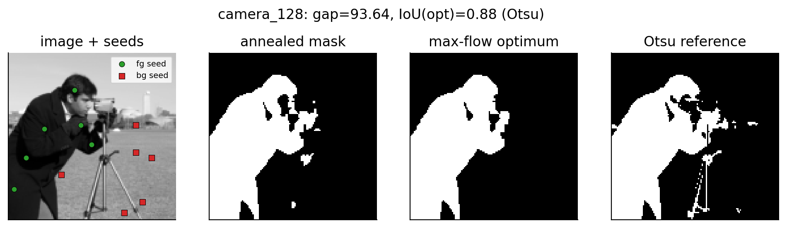
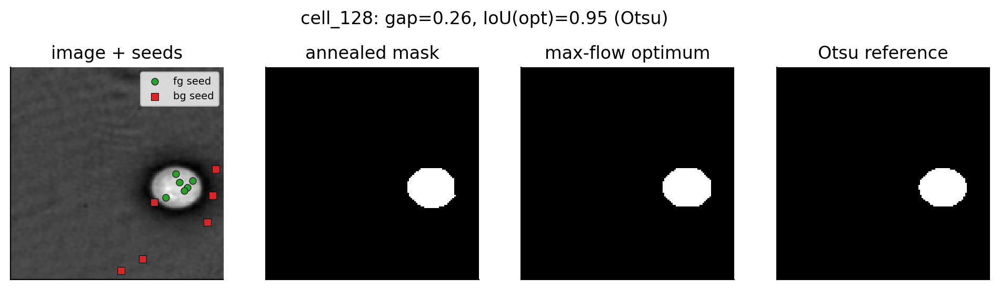
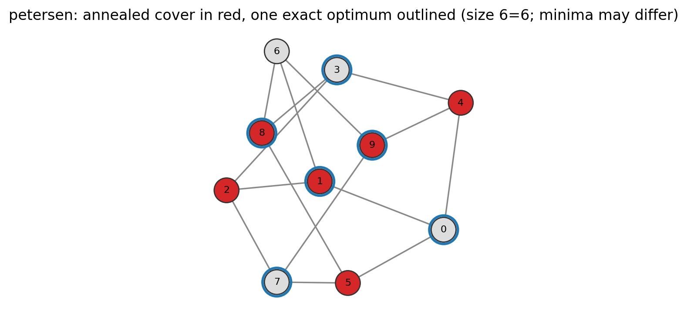
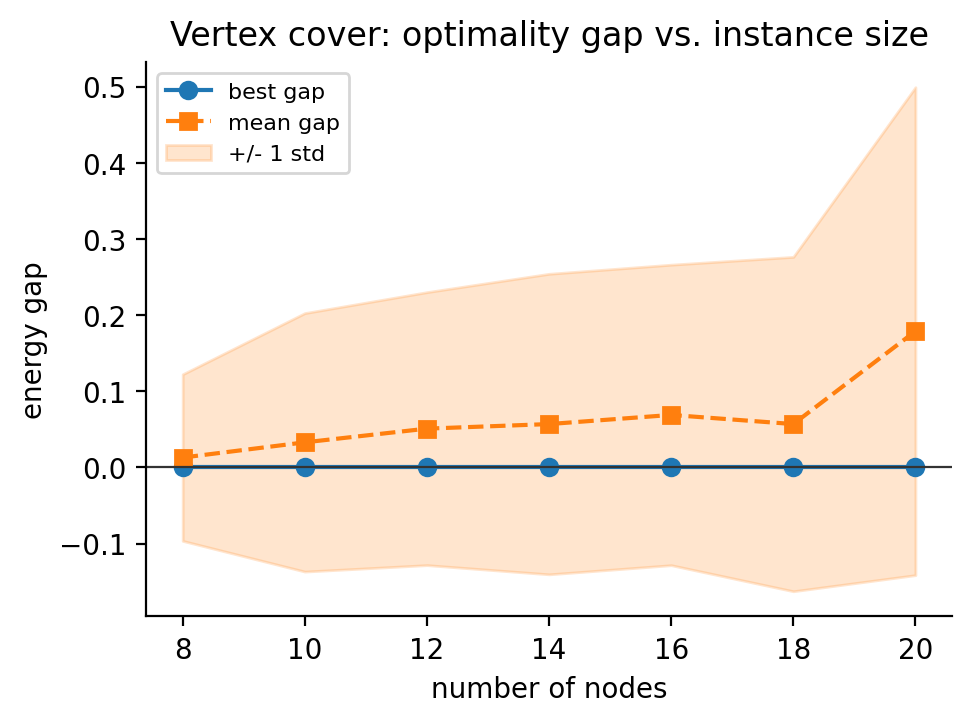

# A Closed-Form QUBO for Graph Partitioning and Image Segmentation


Two superficially different problems — **minimum vertex cover** on a graph and
**foreground/background separation** in an image — are written as a *single*
quadratic unconstrained binary optimization (QUBO) objective

$$H(x) = \sum_i a_i x_i + \sum_{i<j} b_{ij}\, x_i x_j, \qquad x_i \in \{0,1\},$$

and minimized with **one** simulated-annealing sampler rather than a learned
model. Every result is validated against an **exact reference**, and we report
the **energy gap** between the annealed assignment and the optimum — turning
"the solver looks right" into a number.

The project's single takeaway: the same closed-form objective that traces an
object's boundary in an image shares its optimization structure with the
objective an adversary minimizes to recover a hidden graph (GraphMI). A runnable
demonstration of that bridge is included.

> No machine learning, no quantum hardware required. Every rule is an explicit
> term in the objective; the solver only minimizes it. The identical QUBO can
> later be sent to a D-Wave `DWaveSampler` without changing the formulation.

---

## Results at a glance

Real 128×128 photograph (`scikit-image` cameraman) and the simplest synthetic case — the annealed mask is **identical to the exact maximum-flow optimum**, and cleaner than an Otsu threshold:




Minimum vertex cover vs. exhaustive search, and the optimality gap as instances grow:

<p>
  
  
</p>

| Phase | Instances | Headline result |
|-------|-----------|-----------------|
| **1 — Vertex cover** | 12 benchmark graphs (≤20 nodes) | 12/12 valid covers, **12/12 reach the exact optimum** (best gap = 0) |
| **2 — Segmentation (synthetic)** | blobs / squares, 16×16 | annealer **matches the max-flow optimum exactly** (gap 0, success 1.00) |
| **2 — Segmentation (real, 32×32 horses)** | 16 Weizmann horses + GT masks | 11/16 reach the optimum; mean IoU ≈ 0.45, up to 0.76 |
| **2 — Segmentation (high-res, 128×128)** | cameraman, coins, cell, clock, … | IoU 0.88–1.00 on clean objects; masks beat Otsu |
| **3 — Graph reconstruction (GraphMI)** | cycle / path / ER / Petersen | mean edge-F1 ≈ 0.64, up to 0.88, validated vs. analytic optimum |

Full write-up with numbers and the seed/penalty/λ studies: [`docs/FINDINGS.md`](docs/FINDINGS.md).

---

## The three objectives

Every phase shares one structure: **build a QUBO by hand → minimize with the
sampler over many reads → validate against an exact optimum → report the gap.**

| Phase | Problem | Closed-form objective | Exact reference |
|------|---------|------------------------|-----------------|
| 1 | Minimum vertex cover | $\sum_i x_i + P\sum_{(u,v)\in E}(1-x_u)(1-x_v)$ | exhaustive search |
| 2 | Seeded segmentation (Boykov–Jolly) | $\sum_i D_i(x_i) + \sum_{(i,j)} w_{ij}(x_i-x_j)^2$ | maximum flow / min-cut |
| 3 | Graph reconstruction (GraphMI bridge) | $\sum_{(u,v)}\lVert x_u-x_v\rVert^2 e_{uv} + P(\sum e_{uv}-m)^2$ | analytic cardinality optimum |

---

## Quickstart

```bash
git clone <your-repo-url> qubo-partition && cd qubo-partition
python -m venv .venv && source .venv/bin/activate
pip install -e ".[dev,real]"     # or: pip install -r requirements.txt

# run everything end-to-end (fast smoke run):
PYTHONPATH=src python experiments/run_all.py --quick

# run the tests:
PYTHONPATH=src pytest -q
```

Core dependencies: `dimod`, `dwave-samplers`, `dwave-networkx`, `networkx`,
`numpy`, `scipy`, `matplotlib` (plus `pillow`, `scikit-image` for real images).
The project runs end-to-end on a laptop.

### Run on Google Colab (zero local setup)

Open [`notebooks/qubo_partition_colab.ipynb`](notebooks/qubo_partition_colab.ipynb)
in Colab and choose **Runtime → Run all**. It installs the deps, fetches the code
(GitHub clone / zip upload / Drive), downloads the Weizmann horses, and renders
every phase with inline figures. For the zip-upload path, run
`bash scripts/make_colab_zip.sh` locally and upload the resulting
`qubo-partition.zip` when prompted.

---

## Running each phase

```bash
# Phase 1 — vertex cover: benchmarks, gap-vs-size study, penalty (P>1) sweep
PYTHONPATH=src python experiments/phase1_vertex_cover.py --num-reads 200

# Phase 2 — synthetic segmentation: benchmarks, lambda study, seed-sensitivity
PYTHONPATH=src python experiments/phase2_segmentation.py --size 16 --num-reads 200

# Phase 2 — real data (downloads the 32x32 Weizmann horses first)
bash scripts/get_weizmann_horses.sh
PYTHONPATH=src python experiments/phase2_real_horses.py --data datasets/weizmann_horse_32

# Phase 2 — high-resolution images (cameraman / coins / cell / clock / ...)
PYTHONPATH=src python experiments/phase2_hq_images.py --size 128   # 16k pixels, ~73s

# Phase 3 — the GraphMI bridge
PYTHONPATH=src python experiments/phase3_graphmi_bridge.py --num-reads 200
```

Tables (CSV + LaTeX) are written to `results/`; figures to `results/figures/`.

---

## Repository layout

```
src/qubo_partition/
  qubo/
    base.py          QUBO container: energy(), brute_force(), to_bqm()
    vertex_cover.py  minimum-vertex-cover penalty formulation
    segmentation.py  Boykov–Jolly data + smoothness energy (histogram / Gaussian)
  solvers/
    annealer.py      simulated-annealing sampler (Ocean SDK) + ExactSolver cross-check
    exact_vc.py      exhaustive-search minimum vertex cover
    maxflow.py       submodular energy -> exact s-t min cut (integer, bounded-INF)
  data/
    graphs.py        graph generators + benchmark suite
    images.py        synthetic grayscale images + seed masks
    real.py          Weizmann horses (32x32) and scikit-image high-res loaders
  evaluation/        validity + optimality-gap metrics, multi-run experiment runner
  bridge/            graph reconstruction as the same QUBO move (GraphMI link)
  viz.py             headless matplotlib figures
  io_utils.py        CSV / JSON / LaTeX-table writers
experiments/         one runnable script per phase + run_all.py
notebooks/           Colab notebook + its generator
scripts/             dataset download, Colab-zip, lint helpers
tests/               pytest correctness suite (formulation == exact reference)
docs/FINDINGS.md     experimental write-up
```

---

## Design notes

- **The constant matters.** Penalty reformulations introduce additive constants
  ($P|E|$, $\sum_i D_i(0)$). They do not change the minimizer but they *do*
  change the energy, and we report an energy gap, so `QUBO` carries the offset.
- **$P>1$ is exactly the threshold** for vertex cover: flipping a node to cover
  an uncovered edge changes the energy by $1-P<0$ iff $P>1$, so every global
  minimizer is a valid — and minimum — cover. The penalty sweep confirms it.
- **The segmentation energy is submodular**, so its global minimum is a maximum
  flow; the QUBO and the flow graph are built from the *same* `SegmentationModel`,
  making their energies directly comparable. The min-cut uses integer-scaled,
  bounded-infinity seed capacities for numerical robustness.
- **The data term is essential**: without it the all-one-label assignment has
  zero smoothness cost and wins (`test_data_term_breaks_the_trivial_solution`).

## Scope

Nothing is learned from data; every rule is an explicit term in the objective.
Inputs are small and fixed-size (10–20-node graphs; 16×16 / 32×32 images, with
optional high-res demos up to 128×128), so the exact reference stays computable
and the gap is the primary measure of success.

## Development

```bash
bash scripts/lint.sh          # ruff + black check
bash scripts/lint.sh --fix    # auto-apply
pre-commit install            # optional git hook (config in .pre-commit-config.yaml)
```

## References

1. A. Lucas. *Ising formulations of many NP problems.* Frontiers in Physics, 2014.
2. Y. Boykov, M.-P. Jolly. *Interactive graph cuts for optimal boundary & region segmentation.* ICCV 2001.
3. Y. Boykov, V. Kolmogorov. *An experimental comparison of min-cut/max-flow algorithms.* IEEE TPAMI 2004.
4. S. M. Venkatesh et al. *Q-Seg: Quantum annealing-based unsupervised image segmentation.* arXiv:2311.12912, 2024.
5. Z. Zhang et al. *GraphMI: Extracting private graph data from graph neural networks.* IJCAI 2021.

The 32×32 Weizmann horse images/masks are redistributed via the `dvn-horse`
release; the high-resolution demo images ship with `scikit-image`.

## License

MIT.
